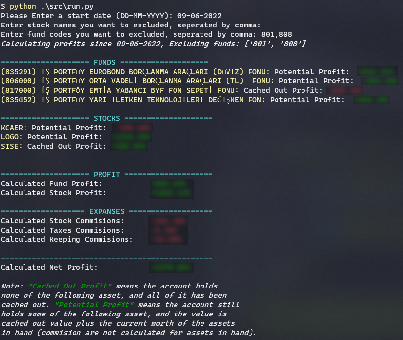

<div align=center>
<h1> Profit Calculator</h1>
</div>

This project aims to calculate the net profit from the investment account statement.

## How to use it?

1. Go to your investment account on the _İşcep_ app and export your investment accounts statement as an excel file.

2. Put the account statement into this directory.

3. Install the python [Docs](https://wiki.python.org/moin/BeginnersGuide/Download)

4. Install the required python packages using the following command:

```terminal
pip install -r requirements.txt
```

5. Run the following command to run the program:

```console
python src/run.py
```

## Example Output


