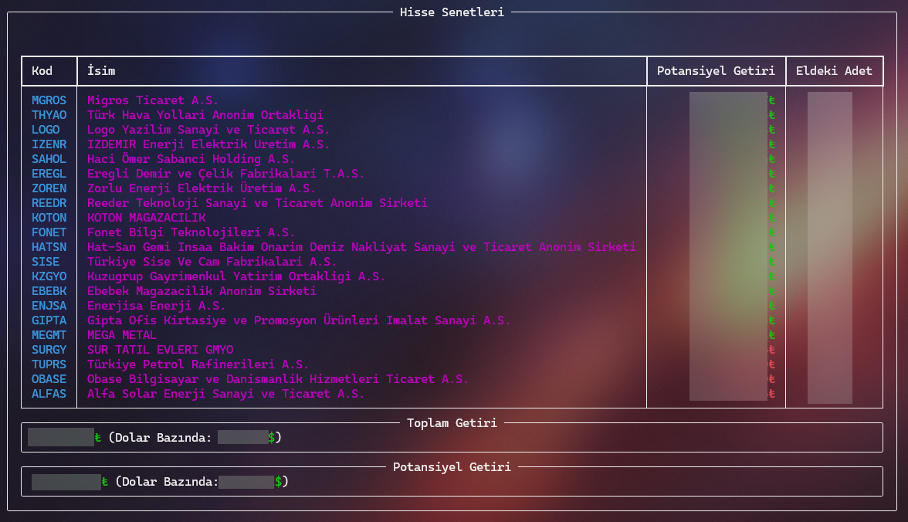
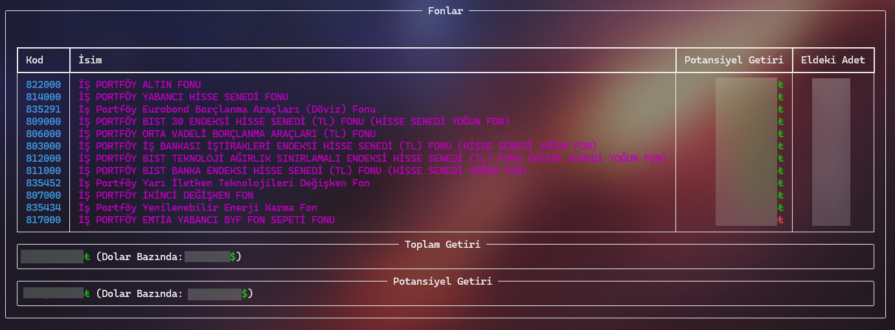
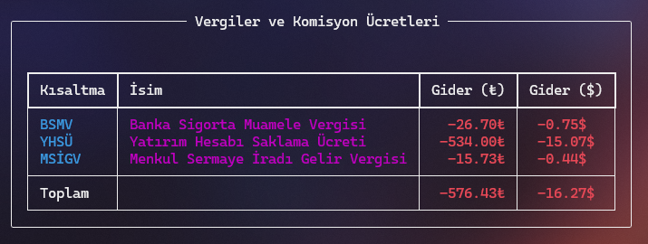
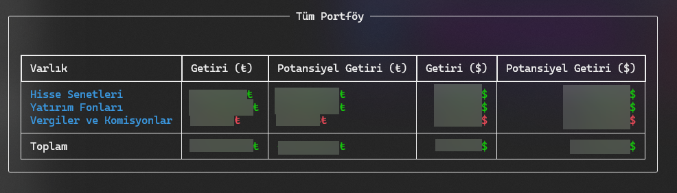

<div align=center>


<br>

<h1><b>Getiri Hesaplayıcı</b></h1>
</div>

> [!IMPORTANT]
> Bu _repo_'nun _İŞ Bankası_ ile herhangi bir bağlantısı yoktur.

## 📖 Amaç

_İşcep_ üzerinden yatırımlarınızı incelerken, sadece aktif olarak portföyünüzde bulunan varlıklar hesaplamaya dahil ediliyor. Yani, elinizde `%50` karda olduğunuz bir `A` hissesi ve `%50` zararda olduğunuz bir `B` hissesi var ise, ve bu iki hisseyi de eşit fiyata temin ettiyseniz, portföyünüzün durumu `+%0` olarak görünecektir.

Buraya kadar her şey çok iyi. Fakat zararda olduğunuz B hissesini, zararına satmanız durumunda portföyünüzde artık sadece `%50` karda olduğunuz `A` hissesi bulunacağından dolayı portföyünüzün durumu `+%50` olarak görünecektir.

Bu _repo_'nun amacı, bu durumun önüne geçerek, getiri hesaplarında portföyde bulunan varlıklara bakmak yerine hesap özeti üzerinden, daha kapsayıcı bir analiz çıkartmaktır.

## 🚀 Nasıl Kullanılır?

1. İlk olarak _İşcep_ uygulaması üzerinden yatırım hesabınıza gidin ve hesap özetinizi, _Excel_ dosyası olarak alınız.
   > _İşcep_, hesap özeti süresinin maksimum iki yıllık veri içermesine izin veriyor fakat son on yıllık veriyi tutuyor. Eğer son 4 yılın verisini istiyorsanız, iki farklı hesap özeti çıkartıp, ikisini de ileride anlatıldığı şekilde `./data` dosyasına atarak birleştirebilirsiniz.

2. Hesap özet(ler)inizi, `./data` dosyasına yerleştirin. Eğer dosyayı görmüyorsanız oluşturabilirsiniz.

3. _Python_ kurun. ([Python Kurulum Rehberi](https://wiki.python.org/moin/BeginnersGuide/Download))

4. Gerekli _Python_ modüllerini kurmak için, aşağıdaki kodu çalıştırın.

```bash
pip install -r requirements.txt
```

5. Aşağıdaki kodu çalıştırarak, uygulamayı çalıştırın.

```bash
python src/run.py
```

> [!TIP]
> Bu aşamada, kullanabileceğiniz argümanlar da bulunmaktadır.
>
> `-exclude_stocks` argümanı ile, seçtiğiniz hisseleri analizden çıkartabilirsiniz.
>
> Örnek:
>
> ```bash
> python .\src\run.py -exclude_stocks "THYAO"
> ```
>
> _THYAO hissesini analize dahil etmez_
>
> `-exclude_funds` argümanı ile, seçtiğiniz fonları analizden çıkartabilirsiniz.
>
> Örnek:
>
> ```bash
> python .\src\run.py -exclude_stocks "801,808"
> ```
>
> _801 ve 808 fonlarını analize dahil etmez_

## 📊 Örnek Çıktı

> [!NOTE]
> Örneklerin bazılarından, varlık miktarlar ve değerleri çıkartılmıştır.

<details>
  <summary>Hisse Senetleri</summary>



</details>

<details>
  <summary>Yatırım Fonları</summary>



</details>

<details>
  <summary>Vergiler</summary>



</details>

<details>
  <summary>Tüm Portföy</summary>



</details>

## ⚠️ Bilinen Limitasyonlar

1. `ALTIN.S1` (Altın Darphane Sertifikası) desteklenmemektedir. (hisseler için kullanılan _yahoofinance_ modülü desteklemediğinden dolayı)
2. Sadece _İŞ Portföy_ yatırım fonları desteklenmektedir. Fon verileri [bu site](https://www.isportfoy.com.tr/getiri-ve-fiyatlar) ve [bu siteden](https://www.isbank.com.tr/tefas) alınmaktadır.
3. Hisse Senetleri için sadece **BIST** desteklenmektedir.
